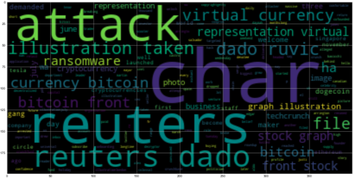
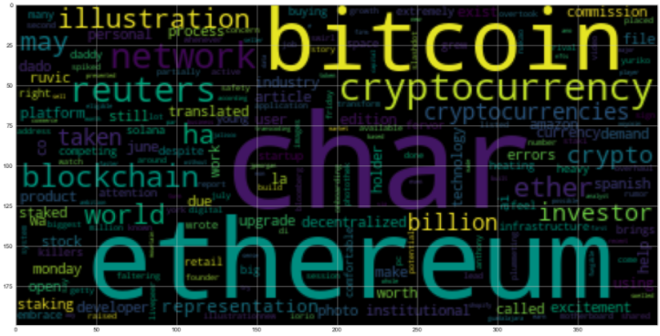
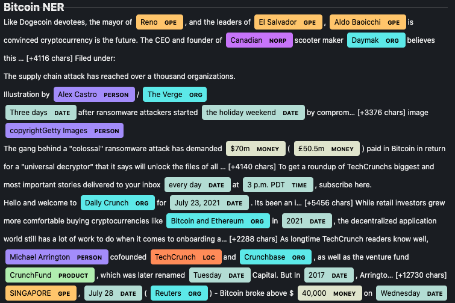
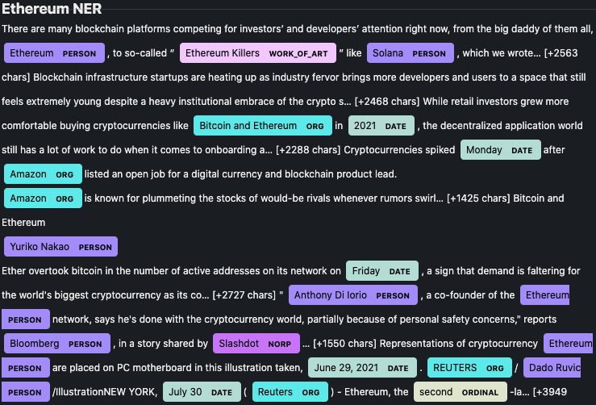

# Summary of Tales from the Crypto

## Sentiment Analysis

- Ethereum had the highest mean positive score.
- Ethereum had the highest compound score.
- Ethereum had the highest positive score.

---
## Natural Language Processing

*  The top 10 words for Bitcoin:
    + `[(('reuters', 'dado'), 7),
 (('illustration', 'taken'), 6),
 (('dado', 'ruvic'), 6),
 (('virtual', 'currency'), 5),
 (('currency', 'bitcoin'), 5),
 (('bitcoin', 'front'), 5),
 (('reuters', 'bitcoin'), 4),
 (('representation', 'virtual'), 4),
 (('front', 'stock'), 4),
 (('stock', 'graph'), 4),
 (('graph', 'illustration'), 4),
 (('char', 'reuters'), 3),
 (('file', 'photo'), 3),
 (('june', 'reuters'), 3),
 (('char', 'representation'), 3),
 (('attack', 'ha'), 2),
 (('char', 'image'), 2),
 (('ransomware', 'attack'), 2),
 (('bitcoin', 'ethereum'), 2),
 (('july', 'reuters'), 2)]`

*  The top 10 words for Ethereum:
    + `[(('ethereum', 'network'), 5),
 (('cryptocurrency', 'ethereum'), 4),
 (('bitcoin', 'ethereum'), 3),
 (('illustration', 'taken'), 2),
 (('taken', 'june'), 2),
 (('june', 'reuters'), 2),
 (('reuters', 'dado'), 2),
 (('dado', 'ruvic'), 2),
 (('la', 'char'), 2),
 (('char', 'ether'), 2),
 (('ether', 'holder'), 2),
 (('holder', 'staked'), 2),
 (('staked', 'billion'), 2),
 (('billion', 'worth'), 2),
 (('worth', 'cryptocurrency'), 2),
 (('network', 'excitement'), 2),
 (('char', 'article'), 2),
 (('article', 'wa'), 2),
 (('wa', 'translated'), 2),
 (('translated', 'spanish'), 2)]`

* The top 10 words for Bitcoin:
    + `[('char', 20),
 ('reuters', 16),
 ('bitcoin', 14),
 ('illustration', 11),
 ('attack', 7),
 ('taken', 7),
 ('dado', 7),
 ('ruvic', 6),
 ('file', 5),
 ('virtual', 5)]`

* The top 10 words for Ethereum:
    + `[('char', 20),
 ('ethereum', 14),
 ('bitcoin', 8),
 ('cryptocurrency', 8),
 ('network', 7),
 ('reuters', 7),
 ('blockchain', 5),
 ('world', 4),
 ('ha', 4),
 ('ether', 4)]`
---
## Bitcoin Word Cloud

## Ethereum Word Cloud

---
## Named Entity Recognition
### Bitcoin Entities:

`Reno: GPE,
El Salvador: GPE,
Aldo Baoicchi: GPE,
Canadian: NORP,
Daymak: ORG,
Alex Castro: PERSON,
The Verge: ORG,
Three days: DATE,
the holiday weekend: DATE,
copyrightGetty Images: PERSON,
$70m: MONEY,
£50.5m: MONEY,
every day: DATE,
3 p.m. PDT: TIME,
Daily Crunch: ORG,
July 23, 2021: DATE,
Bitcoin and Ethereum: ORG,
2021: DATE,
Michael Arrington: PERSON,
TechCrunch: LOC,
Crunchbase: ORG,
CrunchFund: PRODUCT,
Tuesday: DATE,
2017: DATE,
SINGAPORE: GPE,
July 28: DATE,
Reuters: ORG,
40,000: MONEY,
Wednesday: DATE,
Reuters: ORG,
FILE: ORG,
June 7, 2021: DATE,
REUTERS: ORG,
Edgar Su/Illustration/File Photo: PERSON,
Reuters: ORG,
+304: PERSON,
March 15, 2021: DATE,
REUTERS: ORG,
Dado Ruvic/: PERSON,
June 30: DATE,
Reuters: ORG,
James Martin/CNET: PERSON,
UK: GPE,
Spain: GPE,
Twitter PRODUCT
2020: DATE,
the US Department of Justi: ORG,
May 19, 2021: DATE,
REUTERS: ORG,
Dado Ruvic: PERSON,
Reuters: ORG,
5.17% PERCENT
33: MONEY,
November 19, 2020: DATE,
REUTERS: ORG,
Dado Ruvic/Illustration
SINGAPORE: ORG,
July 21: DATE,
Reuters: ORG,
Reuters: ORG,
FILE: ORG,
November 19, 2020: DATE,
REUTERS: ORG,
Dado Ruvic/Illustration
SINGAPORE: ORG,
June 29, 2021: DATE,
REUTERS: ORG,
Dado Ruvic: PERSON,
Ju: PERSON,
REUTERS: ORG,
Dado Ruvic/Illustration: PERSON,
10 CARDINAL
the Opening Bell: ORG,
first ORDINAL
Entrepreneur: ORG,
first ORDINAL
more than three decades ago: DATE,
six months ago: DATE,
dozens CARDINAL
February 9, 2021: DATE,
REUTERS: ORG,
Dado: GPE,
Reuters: ORG,
Tesla Inc: ORG,
2020: DATE,
Kaseya: PERSON,
Russian: NORP,
hundreds CARDINAL
Concord Acquisition Corp: ORG,
SPAC: ORG`

### Ethereum Entities:

`Ethereum: PERSON,
Ethereum Killers WORK_OF_ART
Solana: PERSON,
Bitcoin and Ethereum: ORG,
2021: DATE,
Monday: DATE,
Amazon: ORG,
Amazon: ORG,
Yuriko Nakao: PERSON,
Friday: DATE,
Anthony Di Iorio: PERSON,
Ethereum: PERSON,
Bloomberg: PERSON,
Slashdot: NORP,
Ethereum: PERSON,
June 29, 2021: DATE,
REUTERS: ORG,
Dado Ruvic: PERSON,
July 30: DATE,
Reuters: ORG,
second ORDINAL
more than $13 billion: MONEY,
2.0 CARDINAL
Photothek: PERSON,
more than $13 billion: MONEY,
2.0 CARDINAL
Livepeer: PERSON,
$20 million: MONEY,
Ethereum: PERSON,
Spanish: NORP,
AI: ORG,
Xoy Capital: PERSON,
Guadalajara: GPE,
Jalisco: GPE,
Xoycoin: PERSON,
$40 billion: MONEY,
2025: DATE,
JP:Morg,an: ORG,
recent months: DATE,
Monday: DATE,
Chicago Bulls: ORG,
American Express: ORG,
Spanish: NORP,
AI: ORG,
The Securities and Exchange Commission: ORG,
London: GPE,
Ethereum: PERSON,
12 965 000 CARDINAL
August 3-5, 2021: DATE,
Clie: PERSON,
Reuters: ORG,
FILE: ORG,
June 7, 2021: DATE,
REUTERS: ORG,
Edgar Su/Illustration/File Photo: PERSON,
Reuters: ORG,
+304: PERSON,
Hackaday: DATE,
Proof of Work WORK_OF_ART
Bitcoin, Ethereum: ORG,
May 19, 2021: DATE,
REUTERS: ORG,
Dado Ruvic: PERSON,
Reuters: ORG,
5.17% PERCENT
33: MONEY`

